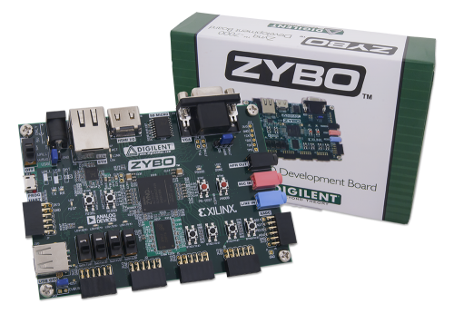

<p align="center"> 

</p>

# Course instructor


  * CHERIF Bilel
  * email : bcherif@laas.fr


# Documentation

```c                                                                 
   _____        _____      _____  _____   ______          ______   
  /    /|___   |\    \    /    /||\    \ |\     \     ___|\     \  
 /    /|    |  | \    \  /    / | \\    \| \     \   /    /\     \ 
|\____\|    |  |  \____\/    /  /  \|    \  \     | /    /  |     |
| |   |/    |___\ |    /    /  /    |     \  |    ||    |   |     |
 \|___/    /    |\|___/    /  /     |      \ |    ||\    \  |__   | 
    /     /|    |    /    /  /      |    |\ \|    || \    \\`  \ /|    
   |_____|/____/|   /____/  /       |____||\_____/| \ \ ___\\   \ |  
   |     |    | |  |`    | /        |    |/ \|   ||  \ |    ||___|/   
   |_____|____|/   |_____|/         |____|   |___|/   \|____||   | 
     \(    )/         )/              \(       )/        \(  |___|   
      '    '          '                '       '          '    )/     
                                                               '  
==========================================================================
| --------------------------Choose your weapon---------------------------|
|------------------------------------------------------- Try this at home|
==========================================================================
1. Read TRM (too many pages => Hardcores).
2. Read Zynq book (no technical details => Bored and have nothing to do).
3. Code at home and hack the bsp! ( Requires 1&2 => Brave hearts).
4. Read the chronicles of microzed ( complete simple apps tutos => lazy).

Student@insa:~/be_zynq/course$

```

  * Zynq book [link](http://www.zynqbook.com) : un livre sur le SOC Zynq de renommée internationale
  *  Altera (le concurrent de ZYNQ, utilise le même contrôleur d'interruption que ZYNQ puisqu'il est fabriqué par ARM) propose une documentation plus digeste que celle de ARM ou Xilinx. [link](5siec_zynq_datas/using_gic.pdf)
  * ARM A9 [link](5siec_zynq_datas/arm_a9_intro_alt.pdf) Intro ARM9 faite par Altera
  * Zynq TRM [link](https://www.xilinx.com/support/documentation/user_guides/ug585-Zynq-7000-TRM.pdf)
  * Vivado HLS user manual [link](https://www.xilinx.com/support/documentation/sw_manuals/xilinx2014_1/ug902-vivado-high-level-synthesis.pdf)

## Course files

 * Course 0x00 (overview) [link](5siec_zynq_datas/overview.pdf)
 
 * Course 0x01 [link](5siec_zynq_datas/cours_01.pdf)
 
  * Course 0x01 part 2 [link](5siec_zynq_datas/course_01_02.pdf)

 * Course 0x02 [link](5siec_zynq_datas/cours_2.pdf)
 


# TP Files

## TP 01 doccuments

  * TP0x01 [link](5siec_zynq_datas/tp01.pdf)
  * TP0x01 guide [link](5siec_zynq_datas/tp01_guide.pdf)
  * Trying to explain IRQ handling mechanism in one page [link](5siec_zynq_datas/irq_handling.pdf)
  * Bare metal drivers doccumentation [link](http://www.wiki.xilinx.com/Baremetal+Drivers+and+Libraries)
  * Cortex A9 Processor Exception Handling (ckeck this link for a better understanding of the xilinix supplied exception handler page 23) [link](https://www.xilinx.com/support/documentation/sw_manuals/xilinx2015_1/oslib_rm.pdf)
  * Zybo referance manual [link](https://www.xilinx.com/support/documentation/university/XUP%20Boards/XUPZYBO/documentati/ZYBO_RM_B_V6.pdf)

## TP 02 doccuments

  * TP0x02 [link](5siec_zynq_datas/tp02.pdf) (a report should be sent to my email by the end of the TP)(this is a two sessions TP)
  * the report should contain the simulation waveform, the response to questions, the hdl codes, and the c code
  * Constraints file [link](5siec_zynq_datas/zybo_master.doc)
  * Video tutorials :
  
| Thing              | Link        |
| :-------------------: | :-----------: |
| Adding constraints file          | [](https://www.youtube.com/watch?v=baFEqLVBG1E) |
| IP creator   | [](https://www.youtube.com/watch?v=gnbRVULOWoU) |
| IP packaging             | [](https://www.youtube.com/watch?v=Xzvocc-HCl0&feature=youtu.be)        |
| Writing to memory addresses             | [](https://www.youtube.com/watch?v=pGkhvc36sgU)        |


# TD

## Double handshake protocol TD1

  * TD0x01 [link](5siec_zynq_datas/td01.pdf)
  > Sorry for the mistake on td 01
  > Question should be :
  >- Extract the condition using the ready and valid signals to allow reading the data line.
  >- Write a process that allows to reset the ready signal using rst signal and to set the ready signal.
  >- Write the process that allows storing the content of data an internal register of the slave module when the handshake occurs and reset the register content to zeros when a reset occurs.
  >- write a testbench to validate your hdl module.
  * Testbench example [link](5siec_zynq_datas/testbench.vhd)
  * Exo1 source codes :
   > 1. TB EX01 [link](5siec_zynq_datas/tb_td_ex01.vhd)
   > 2. EXO01 [link](5siec_zynq_datas/td_ex01.vhd)
   * Exo2 source codes :
   > 1. TB EX02 [link](5siec_zynq_datas/diy_rvhTB.vhd) 
   > 2. EX02 [link](5siec_zynq_datas/diy_rvhTB.vhd) 

## Hardware debug TD2

  * TD0x02 [link](5siec_zynq_datas/td02.pdf)
  * ILA documentation [link](https://www.xilinx.com/support/documentation/ip_documentation/ila/v6_1/pg172-ila.pdf)
  * JTAG to AXI Master documentation [link](https://www.xilinx.com/support/documentation/ip_documentation/jtag_axi/v1_2/pg174-jtag-axi.pdf)
  * ILA video Tutorial [link](https://www.youtube.com/watch?v=SllATwKoBmA&feature=youtu.be)
  


# Final project

In this project we will develop a prototype pf a guitar multi-effects pedal (we will use just two effects to demonstrate the feasibility of the Project).

  * Project doccument [link](5siec_zynq_datas/project.pdf)
  * Constraints file [link](5siec_zynq_datas/project_constraints.doc)
  * Zybo audio control IP [link](5siec_zynq_datas/xilinx_com_zybo_audio_ctrl_1.0.zip)
  * audio driver source code [link](5siec_zynq_datas/src.rar)
  * SSM2603 datasheet [link](http://www.analog.com/media/en/technical-documentation/data-sheets/SSM2603.pdf)
  * VHDL Testbench generation tool [here](http://vhdl.lapinoo.net/testbench/)
  
  ```c
  
 .----------------.  .----------------.  .----------------.  .----------------. 
| .--------------. || .--------------. || .--------------. || .--------------. |
| |  _______     | || |     ____     | || |     ______   | || |  ___  ____   | |
| | |_   __ \    | || |   .'    `.   | || |   .' ___  |  | || | |_  ||_  _|  | |
| |   | |__) |   | || |  /  .--.  \  | || |  / .'   \_|  | || |   | |_/ /    | |
| |   |  __ /    | || |  | |    | |  | || |  | |         | || |   |  __'.    | |
| |  _| |  \ \_  | || |  \  `--'  /  | || |  \ `.___.'\  | || |  _| |  \ \_  | |
| | |____| |___| | || |   `.____.'   | || |   `._____.'  | || | |____||____| | |
| |              | || |              | || |              | || |              | |
| '--------------' || '--------------' || '--------------' || '--------------' |
 '----------------'  '----------------'  '----------------'  '----------------' 
     
===============================================================================
| ----------------------------------Ba byee-----------------------------------|
|---------------------------------------------------------------- Good luck!!!|
===============================================================================

Student@insa:~/be_zynq/course$ ./be_zynq
Student@insa:~/be_zynq/course$ Press any key to rock and roll: 

```
